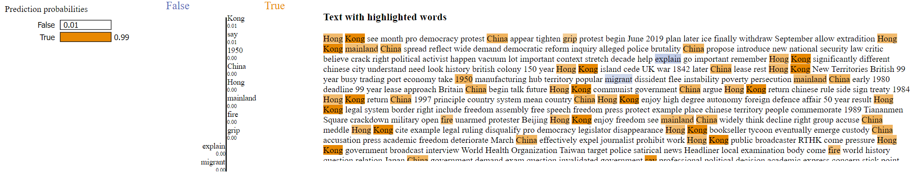

* By splitting the original dataset into test and train, with 4 epochs and batch size of 128, the model is able to achieve 98% accuracy with a loss of 0.0736. 
* Yet for an BBC fake news article about the Hong Kong protest in 2019, we see the following Lime result:
